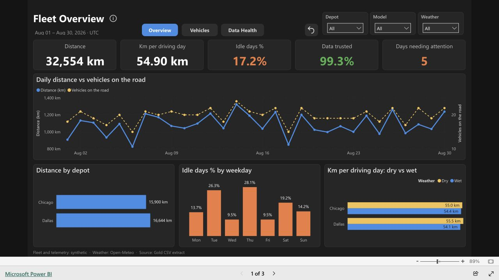
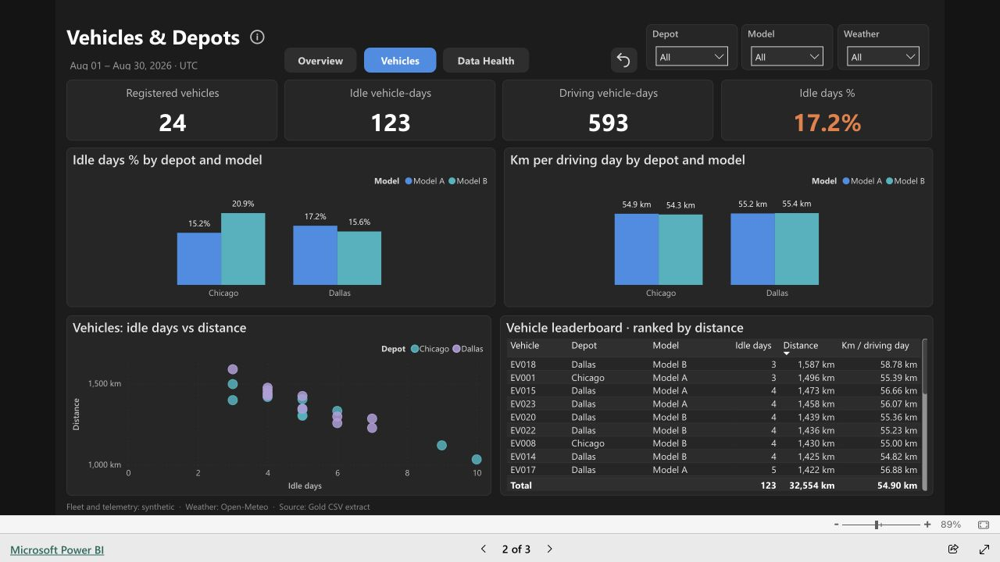
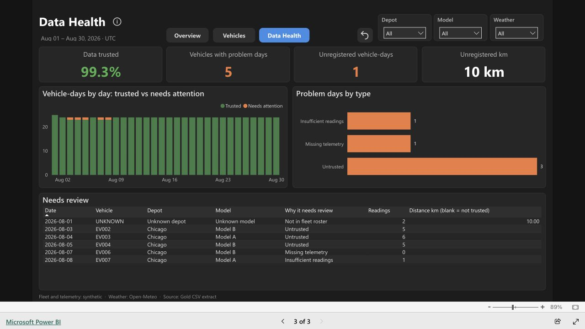

# EV Fleet Activity Lakehouse

A readable PySpark and Delta Lake project that combines **telemetry files, a fleet SQL database, and a real weather API** into Gold data for a separate Power BI report.

**[Open the interactive Power BI report](https://app.powerbi.com/view?r=eyJrIjoiMzUzYmU0YWEtYzU4NC00NmE1LTk2NmYtZjI4YTViMDhjMjY1IiwidCI6IjhiYmMwZjRiLTVkNWItNGNiMy05ZWM5LTc1MTc0MjRmMzY0ZiJ9&pageName=overview)** — public access, no sign-in required.

**Business question:** how does observed vehicle movement vary by depot, vehicle model, and weather condition—and where is the data too incomplete or inconsistent to report a distance?

```text
Synthetic JSONL telemetry ──→ Bronze ──→ checked readings / quarantine ──┐
Synthetic fleet SQLite DB ──→ SQL extraction ──→ vehicle and depot ─────┼─→ Gold vehicle/day fact ─→ Power BI + Databricks dashboards
Open-Meteo historical API ──→ saved JSON ──→ daily weather ─────────────┘
```

[Start and run the project](fleet_activity/README.md) · [Bronze](fleet_activity/notebooks/01_bronze_ingestion.ipynb) · [Silver](fleet_activity/notebooks/02_silver_cleaning.ipynb) · [Gold](fleet_activity/notebooks/03_gold_activity.ipynb) · [Practice rebuilding](fleet_activity/REBUILD.md) · [Validation and reviews](fleet_activity/evidence/README.md)

## Report preview

**Overview:** observed distance, driving activity, idle days, and data coverage across the reporting period.



<details>
<summary>Vehicles &amp; Depots — compare usage and inspect individual vehicles</summary>



</details>

<details>
<summary>Data Health — inspect missing, inconsistent, and unregistered records</summary>



</details>

Captured from the public report on 12 September 2026 with all filters set to All. These are static previews; use the report link above to explore. [Screenshot provenance and known footer discrepancy](docs/screenshots/README.md).

## What it demonstrates

- Explicit-schema JSON ingestion and real Delta table writes.
- SQL extraction from a local SQLite database, with a declared static roster.
- A real REST API request, bounded retries, response checks and saved inputs for reproducible reruns.
- SQL window functions in Spark, deduplication, quarantine, and consistent joins across three sources.
- A vehicle/date grid that reveals missing telemetry and retains unknown vehicles.
- Tests that exercise the notebook's actual transformation cells.
- Daily Databricks orchestration with successful upstream dependencies and a verified scheduled full-refresh run; see [job review](fleet_activity/databricks/JOB_REVIEW.md).
- Gold data with coverage status and documented measurement limits, ready for a separate reporting layer.

The source systems are intentionally different. Telemetry and fleet records are generated; weather is real historical reanalysis from [Open-Meteo](https://open-meteo.com/en/docs/historical-weather-api). SQLite is a local database, **not a remote JDBC integration**. No claim is made about real fleet behavior or weather causation.

## Measurement

`observed_distance_km` is the odometer range between observed readings **within a UTC day**, reported only when at least two readings pass the checks and the day has no known data issues. It excludes travel outside those observations, including overnight gaps. Missing or questionable data produces a null distance, not zero.

A three-page Power BI report is published with a public recruiter link and now imports directly from Databricks Gold. A Power BI Service on-demand refresh completed on 12 September; daily refresh is configured for 09:00 Central after the 08:00 pipeline. The first automatic Power BI run remains unverified, and the saved Windows model has been synchronized into this repository with connection placeholders. See the [refresh checkpoint](fleet_activity/power_bi/REFRESH_SETUP.md). A [native Databricks SQL dashboard](fleet_activity/databricks/dashboard/README.md) is published and verified against live Gold. See the [Gold-to-Power-BI handoff](fleet_activity/POWER_BI.md).

## Scope and status

The current showcase is entirely in `fleet_activity/`. It is implemented with direct notebook transformations and a small API helper. Local execution, Databricks replay and independent review results are recorded in the linked evidence page. The cloud replay uses saved real API responses; the cloud live request was rate-limited.

This project includes a companion rebuild guide. It demonstrates correctness and integration; it is not a scale benchmark or production deployment.

This is a curated repository with a fresh Git history. It contains the runnable fleet project and its required evidence, without the earlier development repository's unrelated prototypes or private review conversations.

The editable Power BI project uses Databricks Import with connection parameters. A clone needs its own SQL warehouse and OAuth sign-in; the local pipeline and tests run without cloud credentials. See [Power BI setup](fleet_activity/power_bi/README.md).
