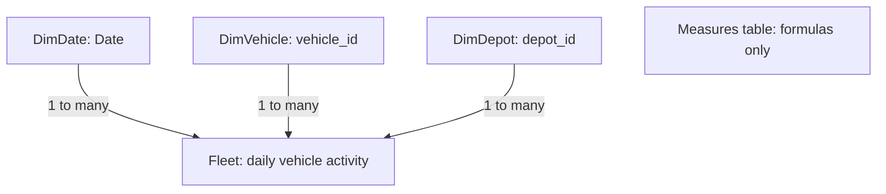

# Understanding the Power BI model

The Gold table has one row per vehicle per UTC day. Power BI keeps that grain in `Fleet` and separates the reusable labels into three dimensions. This is a **star schema** for reporting. It is different from fully normalizing an operational database.

| Table | One row represents | Purpose |
| --- | --- | --- |
| Fleet | One vehicle on one day | Distance, quality status, readings and weather observations |
| DimDate | One calendar date | Group by date, month or weekday |
| DimVehicle | One vehicle | Vehicle ID and model |
| DimDepot | One depot | Depot ID and name |
| Measures table | No business records | Organizes the report's DAX measures |



All three relationships filter in one direction: **dimension → Fleet**. Selecting Chicago in DimDepot filters the matching Fleet rows; measures then calculate over those rows. The Measures table needs no relationship.

`Fleet` keeps its name so existing measures remain easy to follow. Its date and ID columns are relationship keys; they are hidden from the report field list but still available in Model view. Existing detail visuals use the fact keys to preserve their row grain. The report's Model and Depot slicers use dimensions. Daily charts and the weekday chart use DimDate.

## Where the tables come from

The repository and published report use Databricks Gold in Import mode. This repository replaces the working warehouse details with configurable text parameters; see [setup](README.md).

1. `DatabricksHost` and `DatabricksHttpPath` identify your SQL warehouse; set them before refreshing.
2. `GoldSource` navigates to the typed Gold table. It is a connection-only Power Query query, not another loaded table. The CSV-specific header and parsing steps are no longer needed.
3. Fleet references GoldSource and removes the model and depot-name labels now stored in dimensions.
4. DimVehicle and DimDepot reference GoldSource, keep their two columns, and remove duplicates.
5. DimDate generates a continuous calendar for the years covered by Gold. Month and weekday names sort by their numeric columns.

The daily charts, vehicle leaderboard and scatter filter to **Vehicle-days > 0**, so a full-year Date table does not imply observations outside the actual reporting period. That also retains days whose records have missing or untrusted distance. In the leaderboard, this excludes label combinations with no matching activity records; zero-fallback count measures can otherwise make those combinations visible.

All source definitions were synchronized from the saved Windows model on 12 September, then warehouse details were parameterized. See [REFRESH_SETUP.md](REFRESH_SETUP.md) for refresh evidence and remaining external checks. Gold and the pipeline do not need to change to create these reporting dimensions.

This demo assumes one model per vehicle and one name per depot. If future data violates that assumption, resolve the source history deliberately; do not change a relationship to many-to-many just to make the error disappear. The unregistered vehicle and Unknown depot/model remain in the model so quality problems are visible.

## DAX to learn

These are study notes, not a claim of unaided proficiency with every function.

Start with these patterns:

| Pattern | What it does | Example in the report |
| --- | --- | --- |
| SUM / AVERAGE | Add a column or calculate its mean | Observed distance / Average distance |
| COUNTROWS | Count daily records | Vehicle-days |
| DISTINCTCOUNT | Count different vehicle IDs | Registered vehicles |
| CALCULATE | Calculate with an additional filter | Trusted vehicle-days |
| KEEPFILTERS | Intersect that filter with the user's selection | Keep an Untrusted selection from turning into trusted data |
| DIVIDE | Divide safely; blank if the denominator is zero | Idle share |
| COALESCE | Use zero when a count is blank | Vehicle-days |
| FORMAT and `&` | Create a text label | Reporting period / Trusted coverage |
| IF / SWITCH | Choose a label from conditions | Status / Review reason columns |

For example:

```dax
Observed distance km =
CALCULATE(
    SUM(Fleet[observed_distance_km]),
    KEEPFILTERS(Fleet[distance_status] = "trusted")
)
```

Read it as: **add the distance for trusted rows within the current selection**.

```dax
Idle share =
DIVIDE([Idle vehicle-days], [Trusted vehicle-days])
```

Read it as: **trusted zero-distance days divided by all trusted days**.

`Idle vehicle-days` uses `== 0`. In DAX, ordinary `= 0` can also match a blank. Missing distance must not be classified as an idle day. Distance measures preserve blank; only counts use a zero fallback.

`Vehicles driving` counts trusted vehicle-days with distance above zero. In the daily chart that equals vehicles driving on that day. Across a month it counts **driving vehicle-days**, not distinct vehicles. The Vehicles page uses that full label.

The approved simplification removes `Idle days per vehicle` and `Most idle vehicle`. Their cards now show **Driving vehicle-days** and **Idle days %** using existing measures. The native vehicle leaderboard still shows each vehicle's idle days; no virtual-table, iterator, TOPN or text-concatenation ranking measure is needed.

## Rebuild in small steps

1. Reference GoldSource, keep depot ID/name, remove duplicates. Check one row per depot.
2. Repeat for vehicle ID/model. Check one row per vehicle.
3. Create the Date table and its date/weekday fields.
4. Create the three one-to-many relationships. Test a Chicago filter.
5. Put the measures in your Measures table and rebuild one distance card.
6. Explain why an untrusted distance is blank and why an idle day is zero.

The saved model uses **TMDL** in `Fleet Activity.SemanticModel/definition/`. Desktop writes these files for you; learning TMDL syntax is not required to rebuild this in the interface. `MEASURES.dax` is a readable reference copy, not a second executable model.
